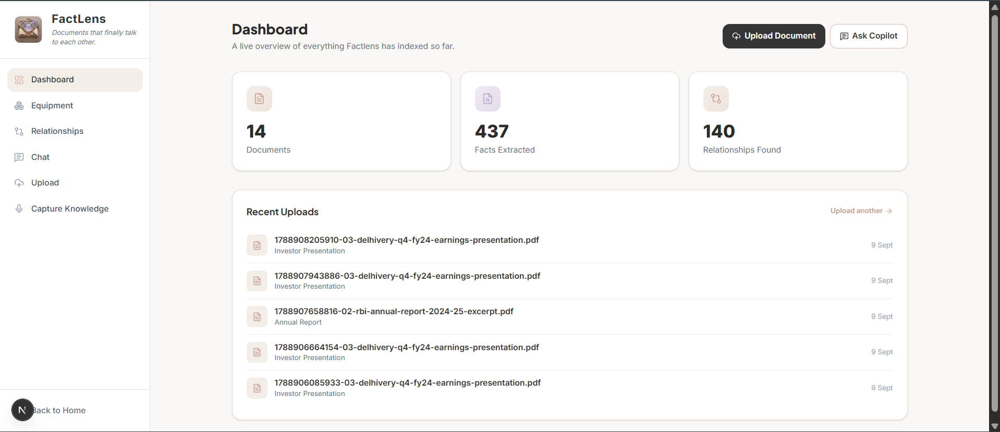
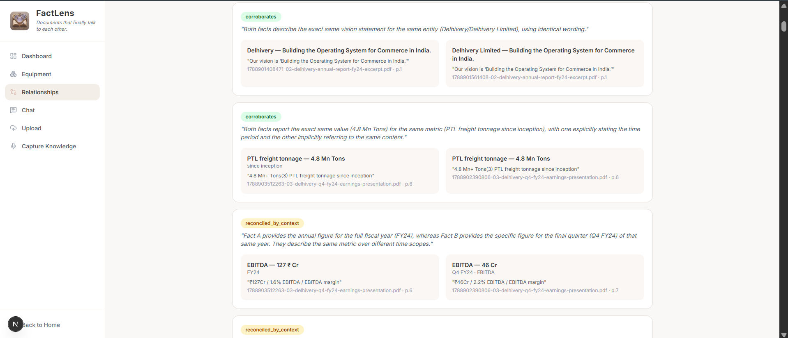

# FactLens

**Live deployment**: https://fact-lens-sage.vercel.app

A fact knowledge layer that extracts atomic facts from PDF documents, links every fact to its verbatim source evidence (document, page, and exact quote), and identifies where facts across documents corroborate, contradict, or are reconciled by context — differences in time period, scope, or units.

Built for the Superjoin VIT 2026 Engineering Intern hiring assignment.

---

## Setup and Run Instructions

### Prerequisites
- Node.js 18+
- A [Supabase](https://supabase.com) project with the `pgvector` extension enabled
- A [Gemini API key](https://aistudio.google.com/apikey) (free tier is sufficient)

### 1. Clone and install
```bash
git clone https://github.com/Radha-byte/FactLens.git
cd FactLens
npm install
```

### 2. Set up the database
In your Supabase project's SQL Editor, run the schema in `supabase/schema.sql` — this creates the `documents`, `facts`, and `fact_relationships` tables, plus the `match_facts` pgvector similarity search function.

Grant the service role the required table privileges (needed once, since tables created via the SQL Editor don't get this automatically):
```sql
grant usage on schema public to service_role;
grant select, insert, update, delete on all tables in schema public to service_role;
grant usage, select on all sequences in schema public to service_role;
```

Create a public storage bucket named `documents` (Storage → New bucket → Public).

### 3. Configure environment variables
Create `.env.local` in the project root:
```
NEXT_PUBLIC_SUPABASE_URL=your-supabase-project-url
NEXT_PUBLIC_SUPABASE_PUBLISHABLE_KEY=your-supabase-anon-key
SUPABASE_SERVICE_ROLE_KEY=your-supabase-service-role-key
GEMINI_API_KEY=your-gemini-api-key
```

### 4. Run
```bash
npm run dev
```
Open `http://localhost:3000`.

### 5. Using it
1. Go to **Upload** and upload a PDF. The pipeline splits it into pages, batches them into Gemini calls (~5 pages per call), extracts atomic facts with page-level citations, verifies each fact's quote against the source text, and embeds it for similarity search.
2. After uploading one or more documents, trigger cross-document relationship matching:
   ```bash
   curl -X POST http://localhost:3000/api/admin/match-relationships
   ```
   On Windows PowerShell:
   ```powershell
   Invoke-WebRequest -Uri http://localhost:3000/api/admin/match-relationships -Method POST
   ```
   This is a deliberately separate, re-runnable step — see *Approach* below for why.
3. Visit **Relationships** to browse fact pairs classified as corroborating, contradicting, or reconciled by context, each shown with both pieces of source evidence and the model's reasoning.

**Note on API quotas**: this runs entirely on Gemini's free tier, which caps both requests-per-minute and requests-per-day. Processing many documents in one session, followed by a full relationship-matching pass, can exhaust the daily limit — see *Limitations*.

---

## Video Demo

https://drive.google.com/file/d/1UDKulX0yVLsqJwXmiDiXgPOmzZ7FpsMa/view?usp=sharing

The video shows a document being processed and walks through all four required cases described below.

---

## Approach

### Architecture
```
PDF upload
   │
   ▼
Per-page text extraction (unpdf) — preserves real page numbers for evidence linking
   │
   ▼
Batched fact extraction (Gemini, ~5 pages per call) — atomic facts as structured JSON:
   subject / predicate / value / unit / time_period / scope / quote / confidence / page_number
   │
   ▼
Quote verification — each fact's quote is checked against its source page's text
(whitespace-normalized) before being accepted; unverifiable facts are logged and dropped
   │
   ▼
Embedding (Gemini embeddings, 768-dim) — stored alongside each fact
   │
   ▼
[separate, re-runnable step] Cross-document matching — pgvector similarity search
finds candidate fact pairs across different documents (same-document pairs excluded,
similarity threshold applied directly in SQL)
   │
   ▼
[separate, re-runnable step] Relationship classification (Gemini) — each candidate
pair is classified as corroborates / contradicts / reconciled_by_context / unrelated,
with a one-sentence reasoning grounded in both facts' evidence
```

At the time of writing, this pipeline has processed **14 documents into 437 extracted facts**, with **140 classified relationships** across all three meaningful relationship types.

### The four required cases





**1. Corroboration** — `EBITDA — ₹127 Cr` (FY24) and `EBITDA margin — 1.6%` (FY24), both extracted from the Q4 FY24 earnings presentation (p.6). The system correctly recognized these as the same underlying data point stated in two different units — an absolute value and a margin percentage — rather than treating them as two unrelated numbers.

**2. Genuine contradiction** — `FY24 EBITDA increased by Rs. 578 Cr` versus `FY24 EBITDA` reported at `Rs. 127 Cr`, both from the same document. The system flagged these as reporting "drastically different values for EBITDA in the same fiscal year." Investigating this case surfaced a real limitation in the system's reasoning, described in Case 4 below.

**3. Reconciled by context** — `EBITDA — ₹127 Cr` (FY24, full year) versus `EBITDA — ₹109 Cr` (Q3 FY24), from two different pages of the same earnings presentation. The system correctly explained the difference as full-year versus single-quarter figures rather than flagging it as a contradiction — the `time_period` field carried through every extracted fact is what made this distinction possible.

**4. Extraction/reasoning failure** — Case 2's "contradiction" is, on inspection, a reasoning limitation rather than a true conflict: the system compared an absolute EBITDA value (₹127 Cr) against a stated *increase* in EBITDA (₹578 Cr) as though they were the same kind of quantity, when one is a level and the other is a change-in-value (a delta). Because the current schema doesn't distinguish "value" facts from "change-in-value" facts as different predicate types, the classifier had no way to recognize this as a category mismatch rather than a genuine disagreement. A more complete system would tag facts by whether they represent an absolute quantity or a delta before comparing them, which would catch this specific failure mode and likely several others like it.

### Key decisions and trade-offs

- **Facts are extracted per page, not per document, and pages are batched** (~5 per Gemini call) rather than processed one at a time. Per-page extraction means every fact carries a real page number for evidence linking; batching keeps the number of API calls manageable against free-tier rate limits without sacrificing that page-level granularity.

- **Every extracted fact is quote-verified before being stored.** The model must cite a verbatim quote for each fact it proposes; that quote is checked against the actual source page text (whitespace-normalized, since PDF line-wrapping doesn't always match how the model renders a sentence) before the fact is accepted. Facts that fail this check are logged and dropped rather than trusted — a deliberate, explicit defense against hallucination, not an afterthought.

- **Relationship matching is a separate, resumable step from ingestion**, triggered manually after uploads rather than running automatically inside the upload request. Chaining extraction, embedding, and classification into one long request per upload made the whole pipeline fragile to any single transient failure — a rate limit or a momentary network blip could abort processing partway through a document. Decoupling means an upload finishes as soon as its own facts are saved, and matching can be triggered, interrupted, and safely re-run without reprocessing or duplicating anything — a uniqueness constraint on fact pairs makes re-runs idempotent.

- **New documents are processed incrementally.** Uploading an additional PDF only extracts and embeds that document's own facts, then matches them against the existing pool — it never reprocesses, re-embeds, or rebuilds anything already stored. This fell out naturally from the architecture above rather than being built as a separate feature.

- **The schema is intentionally generic** (subject / predicate / value / unit / time_period / scope / quote), not shaped around this project's two sample datasets. Nothing in the extraction prompt or the schema assumes financial documents specifically — the same pipeline extracts structured facts from the India macroeconomic reports in the starter dataset without any code changes, in line with the requirement that the system generalize beyond the documents it was built and tested against.

- **AI tools used**: Gemini (`gemini-3.1-flash-lite`) for both fact extraction and relationship classification, and Gemini's embedding model for vector similarity search via pgvector. Claude was used throughout development for architecture planning, debugging, and code review.

---

## Limitations and Next Steps

- **The value-vs-delta reasoning gap** described in Case 4 is the most significant known limitation: the system doesn't yet distinguish an absolute value from a stated change-in-value as different kinds of facts, which can produce a false-positive "contradiction" between two facts that are actually consistent. The fix is a predicate-type classification step before candidate matching, distinguishing level facts from delta facts.
- **Free-tier rate and daily quotas.** Gemini's free tier caps both requests-per-minute and requests-per-day. Processing many documents plus a full relationship-matching pass in one session can exhaust the daily quota, after which the system correctly reports failure via retry-then-error rather than hanging silently — but no further processing is possible until the quota resets. A production version would use a paid tier with true request batching and higher throughput.
- **Schema is fixed, not yet dynamically evolving.** Fact fields are set in advance rather than emerging from the documents themselves, as suggested in the assignment's brownie-point section. A next step would let new fact "shapes" appear as new kinds of documents are ingested.
- **Table-heavy PDF pages** can produce imperfect text extraction — merged or misaligned columns in dense financial statements occasionally limit what the extractor has to work with.
- **Deployment timeout constraint.** The live deployment runs on Vercel's Hobby tier, which caps serverless function execution at 60 seconds — document processing for larger PDFs can exceed this on the deployed version even though it completes fine locally, where no such limit applies. The demo video shows processing running locally for this reason.
- **Large PDFs (500+ pages)** haven't been stress-tested; the per-page batched approach should scale, but this hasn't been verified.

---

## Additional Notes

This system already satisfies one of the brief's suggested extensions without extra engineering: because relationship matching is decoupled from ingestion and keyed off individual facts rather than whole documents, adding a new PDF only processes that document's own facts and matches them against the existing knowledge base — it never rebuilds or re-touches documents already stored.

Development involved substantial hands-on debugging of a real, evolving pipeline — including a page-splitting bug that meant early extractions had no page-level evidence at all, a whitespace-normalization fix for quote verification, and working around Gemini free-tier rate limits by batching pages and decoupling relationship matching into its own step. I've tried to be candid about all of this above rather than presenting only the parts that worked cleanly on the first attempt.